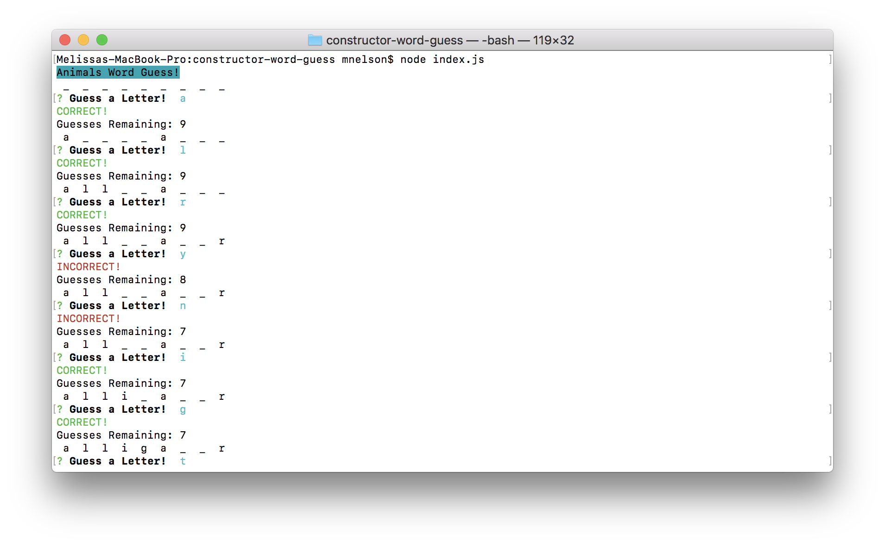
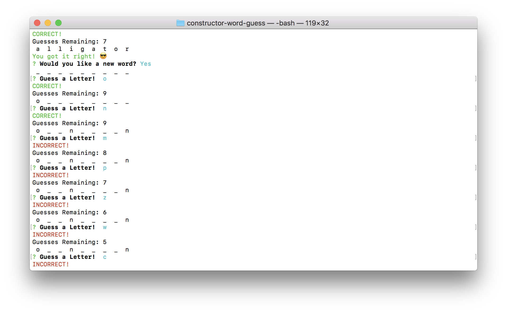
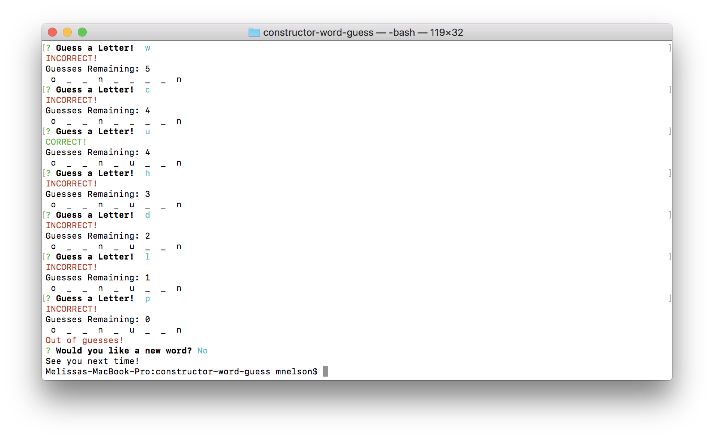

# Constructor Word Guess Game

### Features/Instructions:
* On start, you will be given a random word
* Enter letters one at a time to start guessing the word
* If you guess a correct letter, it will fill in the corresponding blank(s)
* If you guess an incorrect letter, your "guesses remaining" will decrease
    
* If you correctly guess the word, "You got it right!" will display
    
* If you run out of guesses, "Out of guesses!" will display
    
* If you guess the word correctly or run out of guesses, you will be asked if you want a new word
* If you answer "Yes", you will be given a new random word
* If you answer "No", the game will stop

### Languages/Technologies Used:
* JavaScript, Node.js, Command Line, Inquirer, Constructors